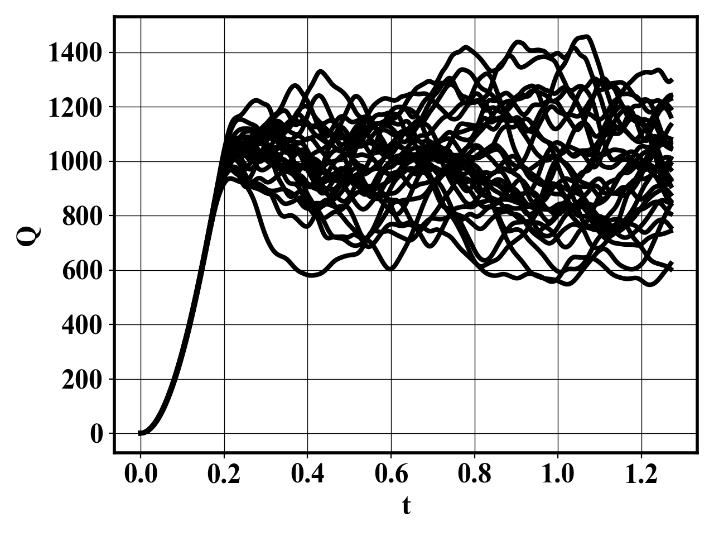
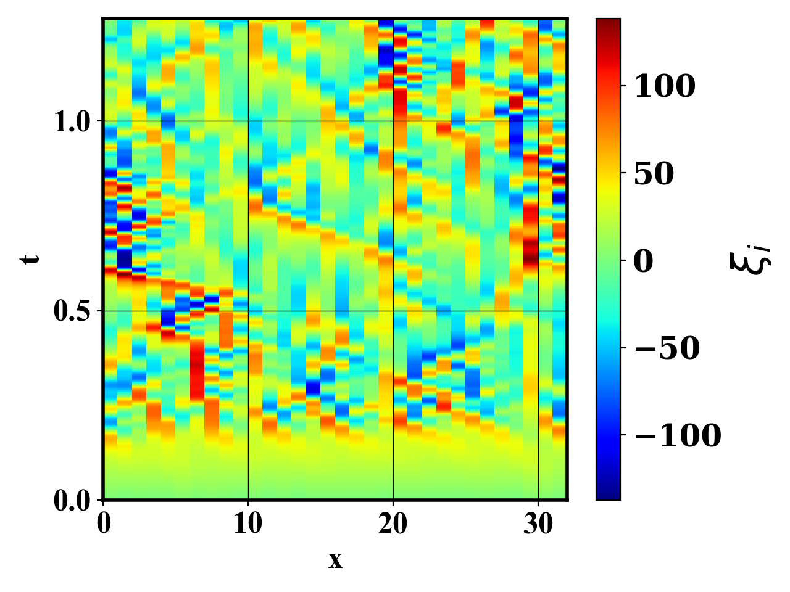
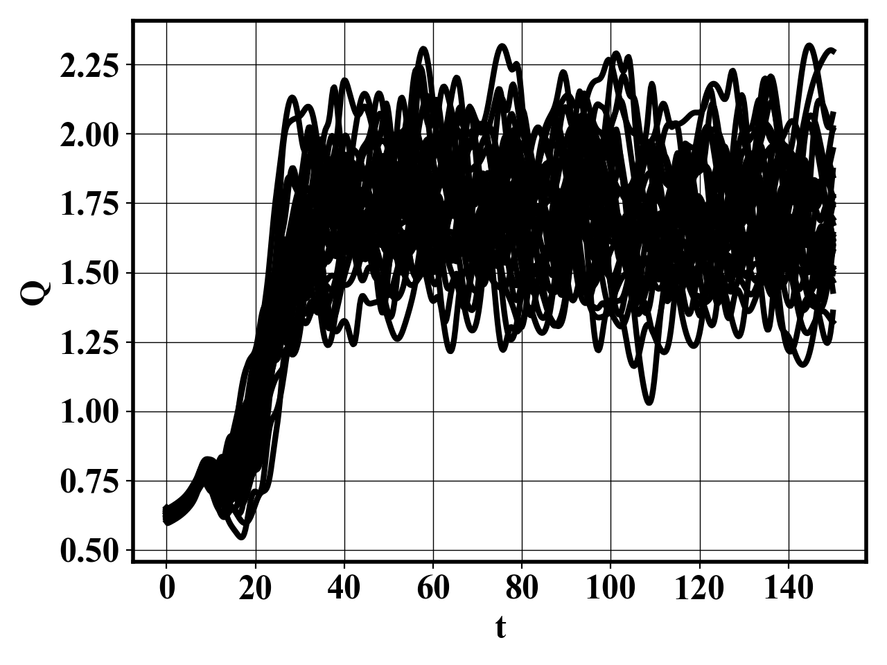
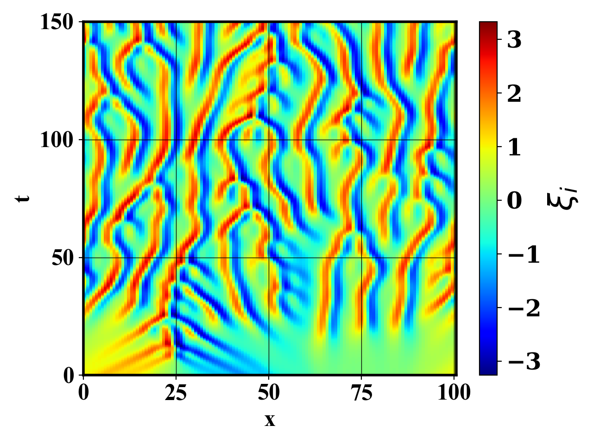

# Monte-Carlo simulation module

## Running the code

`python main.py inputL96` : Runs the brute force realizations of the L96

Gives the following result

  
  

`python main.py inputKS` : Runs the brute force realizations of the KSE

Gives the following result

  
  

`python main.py inputL96FrontBack` : Runs the brute force realizations of the L96 forward for half od the time and backward for the second half

`python main.py inputKSFrontBack` : Runs the brute force realizations of the KSE forward for half od
the time and backward for the second half. Regularized using [Regularization of the backward-in-time Kuramoto–Sivashinsky equation](https://www.sciencedirect.com/science/article/pii/S0377042709008498)

## Parallelization

The code runs multiple independent realizations and is therefore embarassingly parallel. An MPI-parallelization procedure is implemented across realizations.

## Unit test

Makes sure the integrators are correctly implemented

`cd test`
`bash run.sh`

