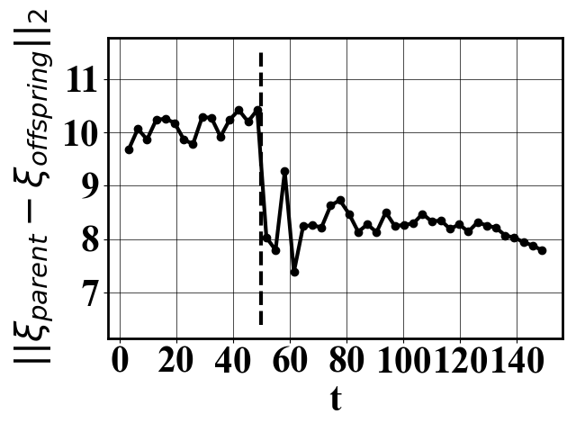
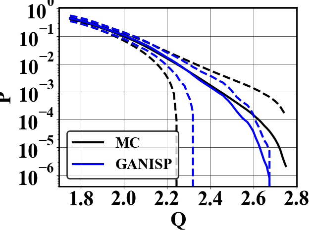

# GAMS with GAN cloning

The genealogical adaptive multilevel splitting is used with a GAN-based cloning to produce clones consistent with the system's attractor.

## Running the code

`bash run_ISP_KS.sh`: Runs GANISP for the KSE.

`python plotResults.py`: Displays the estimated probability with GANISP and shows the distance between the clones and the parent realization.

  
  

