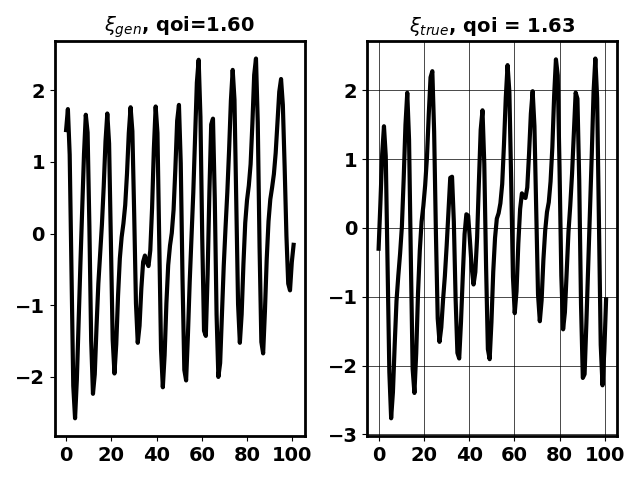

# Diverse Conditional Generative Adversarial Network

A cGAN conditioned on the reaction coordinate is trained to generate ralizations consistent with the attractor of the dynamical system

## Running the code

`python main_trainFull.py`: Trains the GAN. The code will not execute as the training dataset is required and cannot be included due to space constraints. Training dataset available upon request.

`python main_test.py`: Test the generative model obtained. Here, the code will use a pretrained version of the generator. 

`python checkContentLoss.py`: After running the testing script, this verifies that the reaction coordinate generated is consistent with the reaction coordinate of the input. The script uses a pre-generated version of the testing data, but can be replaced by the output obtained from `python main_test.py`

`python checkDiversity.py:` After running the testing script, this verifies that the conditional moemnts of the generated data are consistent with the a priori estimates. The script uses a pre-generated version of the testing data, but can be replaced by the output obtained from `python main_test.py`

`G_epoch00078`: Pretrained model

Example of generated data (left) and true data (right)

