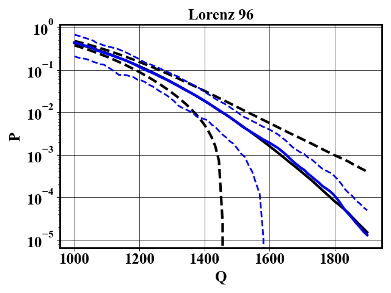

# Genealogical adaptive multilevel splitting (GAMS) with random cloning

## Running the code

`bash run_ISP_KS.sh`: Runs GAMS for the KSE.

`bash run_ISP_L96.sh`: Runs GAMS for L96.

`cd LE; bash run.sh:` Computes the first Lyapunov exponent of the KSE and L96

`python plotComparisonGANISP.py`: Compare the GANISP and GAMS with random cloning

`python plotResults.py:` plot the result of GAMS. Output is shown below

  
  

